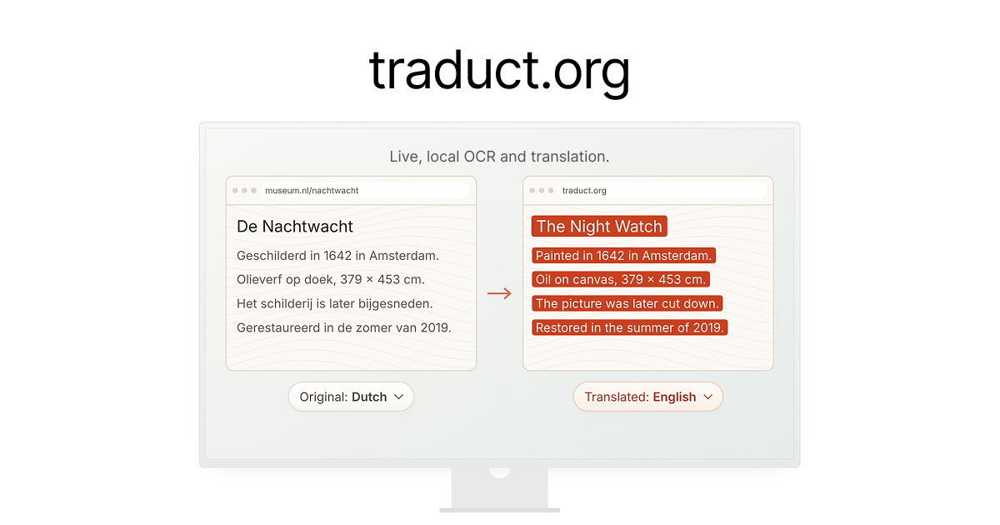

# traduct.org



Translate text in a shared window or screen as you read. traduct.org recognizes
text, translates it locally, and displays the translation over the video.
The text follows the page when you scroll.

Built by [Javier](https://javier.xyz). Find me on
[X (@javierbyte)](https://x.com/javierbyte).

## Getting started

Open [traduct.org](https://traduct.org) in Chrome on desktop, choose your languages, and share a window
or screen. Chrome downloads the translation models the first time you use a
language pair.

Supported languages: German, English, Spanish, French, Italian, Portuguese,
Dutch, and Chinese.

Chrome's Translator API requires free space for its models. The current
requirements are 22 GB free on the profile volume; Chrome removes downloaded
models if free space drops below 10 GB. The API is not available on mobile.

## Run locally

```sh
pnpm install
pnpm dev
```

To build and serve the production version:

```sh
pnpm build
pnpm preview
```

Open http://localhost:4173 after starting the preview server.

## Privacy

Screen capture and text recognition run on your device. Translation uses
Chrome's built-in `Translator` API. The app has no accounts, uploads,
analytics, or error reporting.

Your browser fetches the app and OCR models from the host. Chrome downloads
translation packs from Google. Those requests expose your IP address and
request metadata, but do not include captured pixels or recognized text.
Chrome's other traffic, such as Safe Browsing or profile sync, is separate.

OCR assets are pinned to SHA-256 hashes in
[asset-manifest.js](asset-manifest.js) and checked during the build and when
fetched. The app's Content Security Policy restricts connections to its own
origin. Run `pnpm test:privacy` to check the page's network requests in Chrome.

Chrome documents translation as local, but the page cannot inspect what runs
in the browser process. The
[Translator API specification](https://webmachinelearning.github.io/translation-api/)
leaves that implementation up to the browser. DevTools and the app's Content
Security Policy cannot verify it. You can check that translation works
locally by disconnecting from the network after downloading the models.

### Use offline

1. Run `pnpm install` and `pnpm build` while online.
2. Run `pnpm preview` and open http://localhost:4173.
3. Start a session and select your language pair to download its models.
   Some pairs translate through English and need two packs.
4. Once the models are ready, turn off Wi-Fi or block Chrome with a firewall.
   DevTools' offline setting only affects the renderer, so it does not test
   whether the browser process makes requests.
5. Share a window and translate.

Keep the local server running. The app has no service worker.

## How it works

1. **Capture.** The shared stream plays in a `<video>` element with
   `contentHint = "text"`.
2. **Detect changes.** The OCR worker compares small samples up to 15 times
   per second. It detects changes and estimates how far the page scrolled.
3. **Track scrolling.** Existing translations move with the page so they stay
   readable while you scroll.
4. **Recognize text.** PaddleOCR, using RapidOCR models and ONNX Runtime WASM,
   runs in a worker. It processes one frame at a time and adjusts the frame
   size between 1 and 2 megapixels based on processing time.
5. **Group lines.** Lines are combined into paragraphs by position and text
   color before translation.
6. **Translate.** Paragraphs go to Chrome's `Translator` API. New text replaces
   stale pending batches, and results are cached for each language pair.
7. **Display.** The overlay reuses DOM nodes across frames and moves them
   together during scrolling.

Recognition runs in a worker to keep the interface responsive. The video
plays directly without being copied through a canvas. OCR currently uses
WASM; WebGPU is disabled.

## License

Copyright (C) 2026 Javier Bórquez.

[GPL-3.0](LICENSE). See [third-party notices](THIRD_PARTY_NOTICES.md) for
bundled models, libraries, and fonts.
